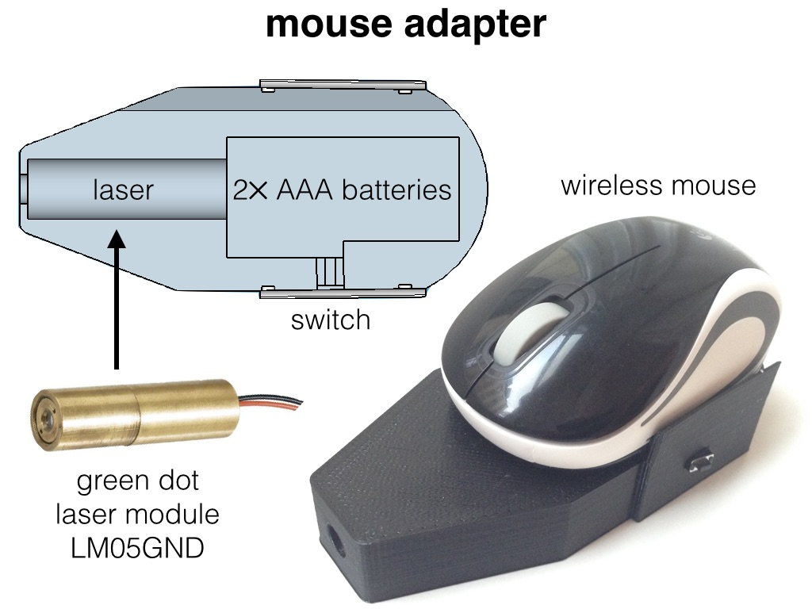

### Description
With FingerBeam you can convert any beamer projection into an interactive screen. This is specially useful for presentations in which interactive visualizations have to be shown. The software consists of a Python program using openCV to track a laser pointer or an LED on the projection of a beamer and move the computer mouse accordingly.

The program uses the following two packages:
- [openCV](http://opencv.org/) for detecting the laser pointer or the LED.
- [autopy](https://github.com/msanders/autopy/) to move the mouse and generate click events.

### Hardware
You need a webcam and a laser pointer (a green powerful one is your best bet). The laser pointer is attached to a small wireless mouse (see figure). The 3D model of the adapter can be found in the *dev* folder of this repo.

The tracking of the laser is used to move the mouse pointer and the wireless mouse is used to send click commands. Alternatively one can use the laser to simulate click events (trigger *mousedown* when laser appears on the image and trigger *mouseup* when laser dissapears), but for the shake of reliability, it is better to use a physical mouse. In this way, unwanted click events are avoided if the openCV program fails in detecting the laser pointer.

For the webcam, any cheap camera is good enough as long as it provides the possibility to disable the auto-focus and the auto-white balance. This is important to avoid unexpected behavior in the computation of the threshold image (see the code). I use a *Logitech HD 1080p*, and then I disable the auto-focus and the auto-white balance using their sofware (*Logitech Camera Settings*). If the projection is too bright as to saturate the camera response, you can install something to block the light in front of the webcam objective. Sometimes I use a couple of cheap polarizer films rotated one to each other an angle close to 90 degrees.

### Usage
1. Connect the webcam and point it to your projection.
2. Run FingerBeam.py and click the four corners of the beamer projection on the video window that appears.
3. Press the key 't' to test the mouse pointer detection.
4. Press the key 'm' to actually move the mouse.
5. Press the key 'c' if you ever want to select a new set of corners.

After you have pressed 'm' you can hide the python program and use the laser as a mouse pointer in your projection.

### License
GNU GENERAL PUBLIC LICENSE v3.0 (see [LICENSE](LICENSE) file).

Enjoy!

Jesús Martínez-Blanco
